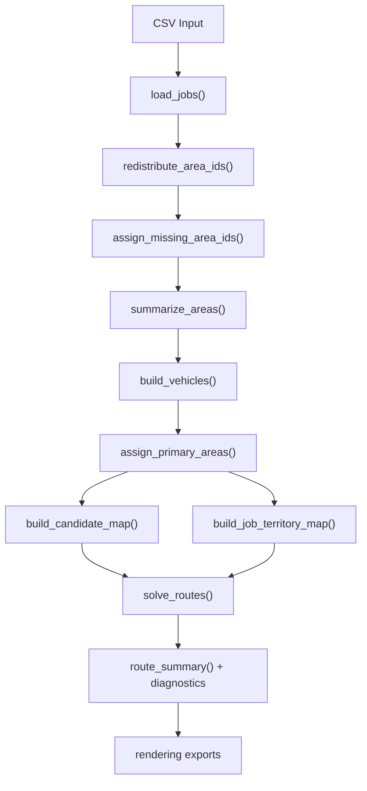
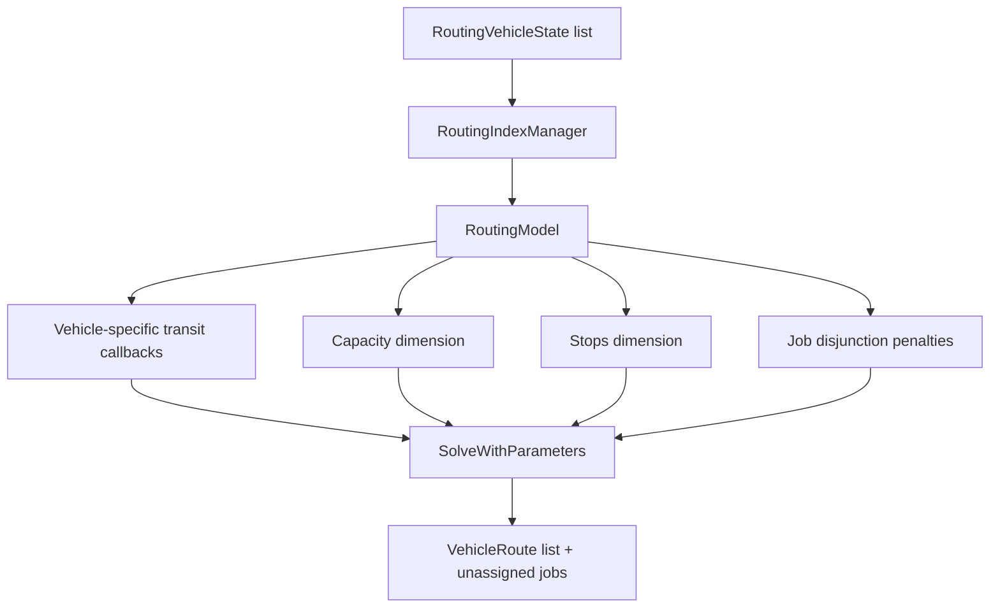

# TF Optimization Code Walkthrough

## How To Run

From the repo root:

```bash
python3 preassign.py
```

By default this reads `drop_points.csv` and writes artifacts into `output/`.
The `preassign.py` command is still supported, but the implementation now lives in the `tfopt/` package.

You can also run the package entry point directly:

```bash
python3 -m tfopt.cli
```

Useful outputs:

- `output/routes_map.html`: interactive route map with route filters, route summaries, vehicle diagnostics, utilization summary, underutilized debug report, and a collapsible/resizable sidebar
- `output/optimized_routes.json`: machine-readable routes, vehicle diagnostics, and underutilized debug details
- `output/preassignment_summary.json`: `redistributed_area_ids`, area ownership, candidate vehicles, territory map, and solver/rebalance flags
- `output/optimized_routes.csv`: flat route stop list for spreadsheet review
- `output/routes.png`: static route overview

Example with custom output directory:

```bash
python3 preassign.py drop_points.csv --output-dir output
```

By default, the pipeline dissolves area code `1111` at runtime before territory
assignment and routing. Each `1111` stop is reassigned to the area of its nearest
existing non-`1111` stop, so the source CSV is not mutated and future input files
can still contain `1111`.

To dissolve a custom set of area codes, repeat `--redistribute-area-id` and include
every code that should be dissolved. When any `--redistribute-area-id` flag is
provided, that explicit list replaces the default `1111` list:

```bash
python3 preassign.py next_input.csv --redistribute-area-id 1111 --redistribute-area-id 9999
```

This README explains the main routing pipeline in this repo:

- `preassign.py`: a compatibility CLI wrapper so existing commands/imports keep working
- `tfopt/`: the end-to-end assignment and OR-Tools routing pipeline, split by responsibility
- `models.py`: the shared data structures used by the pipeline

It intentionally does **not** go deep on:

- `rendering.py`: visualization and export helpers
- `plot_solution_csv.py`: a helper script for redrawing already-solved CSV outputs

Those files are useful, but they are not the core optimization logic.

## Current Module Layout

The code used to live almost entirely in `preassign.py`. It has been split into production-style modules:

- `tfopt/cli.py`: CLI parsing and full pipeline orchestration
- `tfopt/io.py`: CSV loading and JSON writing
- `tfopt/fleet.py`: default fleet specs, vehicle creation, and `--vehicle-spec` parsing
- `tfopt/geo.py`: haversine distance, road-cost approximation, and route-distance helpers
- `tfopt/territory.py`: runtime area redistribution, missing-area normalization, area ownership, candidate ranking, and territory maps
- `tfopt/matrices.py`: OR-Tools distance matrix builders
- `tfopt/scoring.py`: job drop-penalty scoring
- `tfopt/routing.py`: OR-Tools solve passes, repair pass, and merged route assembly
- `tfopt/postprocess.py`: route resequencing, rebalance, distance compaction, and debug reports
- `tfopt/summary.py`: optimized-route summaries and vehicle diagnostics

The detailed walkthrough below keeps the line-by-line explanation style, but the references now point to the actual refactored files and line ranges.

## Project Purpose

The project reads delivery jobs from `drop_points.csv`, dissolves configured problem area IDs such as `1111` at runtime, assigns missing area IDs, builds a soft territory model for vehicles, solves an open-route vehicle routing problem with OR-Tools, rebalances nearby stops to improve utilization, and writes route artifacts such as JSON, CSV, PNG, and HTML.

At a high level, the pipeline is:



## Main Files

### `models.py`

This file contains the data containers the rest of the code passes around. The important split is:

- immutable records: `Job`, `AreaSummary`, `RouteStop`, `VehicleRoute`, `RoutingVehicleState`
- mutable planning state: `Vehicle`

### `tfopt/` and `preassign.py`

The routing work now lives in `tfopt/`. `preassign.py` is only a small wrapper that imports the package entry point and re-exports common helpers for compatibility.

The package does the real work:

1. Load jobs from CSV.
2. Dissolve configured area IDs such as `1111` at runtime without editing the CSV.
3. Normalize blank area IDs.
4. Build fleet objects.
5. Assign each area to a preferred vehicle.
6. Build soft territory preferences.
7. Solve routes with OR-Tools.
8. Rebalance nearby stops on underutilized vehicles.
9. Compact/resequence final routes.
10. Export summaries, diagnostics, debug reports, and visual artifacts.

## `models.py` Line-by-Line Map

### Lines 1-5: imports

- `from __future__ import annotations` lets the file refer to classes before Python fully evaluates them.
- `math` is used for `ceil()` inside `Job.weight_int`.
- `dataclass` and `field` are used to reduce boilerplate for record-like classes.
- typing imports define the shared shapes used throughout the repo.

### Line 8: `Coordinate`

`Coordinate = Tuple[float, float]` standardizes all lat/lon pairs to one alias. Everywhere else in the repo can treat a coordinate as `(lat, lon)` instead of repeating the tuple type.

### Lines 11-33: `Job`

`Job` is the fundamental business object.

- Lines 15-25 store the raw business fields loaded from CSV.
- `frozen=True` makes the object immutable, which is helpful because the same job can be passed through multiple planning stages without accidental mutation.
- Lines 27-29 define `location`, a convenience property returning `(lat, lon)`.
- Lines 31-33 define `weight_int`, which rounds the job’s weight up for integer-based capacity constraints in OR-Tools.

Why it exists:

- OR-Tools capacity dimensions need integer demand.
- the pipeline needs one consistent object for jobs, both before and after routing
- exports and summaries need the original business fields preserved

### Lines 36-62: `Vehicle`

`Vehicle` is the working planning object used before the solver runs.

- Lines 40-48 define static fleet data plus mutable planning state.
- `assigned_jobs`, `remaining_capacity`, `remaining_stops`, and `current_location` are used only in the pre-solver greedy scoring stage.
- Lines 50-53 initialize the mutable derived fields.
- Lines 55-56 answer “can this vehicle still take this job?”
- Lines 58-62 update the temporary greedy state after a tentative assignment.

Why it exists:

- the solver itself gets reduced `RoutingVehicleState` objects later
- the pre-solver candidate ranking needs a mutable object that can simulate “what if this vehicle takes the next job?”

### Lines 65-72: `AreaSummary`

This is a precomputed rollup of all jobs in one area:

- `centroid`
- `total_weight`
- `total_jobs`

Why it exists:

- area ownership logic needs area size and center
- spillover logic needs a quick way to compare jobs to nearby areas
- candidate scoring needs area-level context without recomputing it each time

### Lines 75-85: `RouteStop`

This represents one stop in a solved route. It is effectively the “job after routing,” with sequence information attached.

### Lines 88-96: `VehicleRoute`

This is the solver output shape for one vehicle:

- route identity
- total distance
- total load
- stop count
- ordered list of `RouteStop`

### Lines 99-106: `RoutingVehicleState`

This is a solver-focused vehicle snapshot used for one OR-Tools pass.

Why it exists:

- the first solve uses full vehicle capacity from the depot
- the repair solve uses leftover capacity and leftover stops from the last routed location
- this object captures only what the solver needs, not all of `Vehicle`

## Current Code Walkthrough

This walkthrough is written against the refactored code. These line references point to the current files in `tfopt/`, plus the small compatibility wrapper in `preassign.py`.

## `preassign.py` Compatibility Wrapper

### Lines 1-6: script header and purpose

`preassign.py` is no longer the implementation file. It exists so the familiar command still works:

```bash
python3 preassign.py
```

The docstring states the key contract: implementation lives in `tfopt`, while this wrapper keeps old commands and imports alive.

### Lines 7-45: compatibility re-exports

These imports intentionally re-export common helpers from the new modules:

- `tfopt.cli`: `build_parser`, `main`
- `tfopt.fleet`: fleet defaults and vehicle construction
- `tfopt.geo`: distance helpers
- `tfopt.io`: CSV and JSON helpers
- `tfopt.matrices`: OR-Tools matrix builders
- `tfopt.postprocess`: route cleanup, rebalance, compaction, and debug helpers
- `tfopt.routing`: solver passes
- `tfopt.scoring`: drop penalty
- `tfopt.summary`: route summaries
- `tfopt.territory`: area redistribution, area ownership, and territory maps

This is why older code like `from preassign import load_jobs` still works after the split.

### Lines 50-51: module entry point

If the file is run directly, it calls `tfopt.cli.main()`.

## `tfopt/io.py`: File Loading And JSON Writing

### Lines 1-8: imports

This module owns file I/O and depends only on standard-library CSV/JSON/path helpers plus the shared `Job` dataclass.

### Lines 11-13: `normalize_columns()`

This lowercases and trims CSV header names so schema matching is tolerant of casing and whitespace.

### Lines 16-70: `load_jobs()`

This converts CSV rows into immutable `Job` objects.

Key steps:

- lines 20-23: open the CSV and fail early if the header is missing
- line 25: normalize field names
- lines 27-34: locate required latitude, longitude, weight, and area columns
- lines 36-41: locate optional ID/name/quantity/priority/preference/type columns
- lines 43-68: parse each row into a `Job`

Important behavior:

- accepts `lat` or `latitude`
- accepts `lon` or `longitude`
- accepts `weight` or `total_weight`
- accepts `job_id` or `user_id`
- accepts `name` or `store_name`
- defaults missing quantity to `1`
- keeps blank `area_id` values so `tfopt/territory.py` can repair them consistently

### Lines 73-75: `write_json()`

Pretty-prints JSON output with two-space indentation. `tfopt/cli.py` uses it for `preassignment_summary.json` and `optimized_routes.json`.

## `tfopt/fleet.py`: Fleet Configuration

### Lines 8-16: `VEHICLE_SPECS_DEFAULT`

The default fleet is a list of `(capacity_kg, count, max_stops)` tuples:

- line 9: one 2400 kg vehicle with 15 stops
- line 10: one 2200 kg vehicle with 15 stops
- line 11: two 1300 kg vehicles with 10 stops
- line 12: three 2500 kg vehicles with 18 stops
- line 13: four 2700 kg vehicles with 20 stops
- line 14: seven 3200 kg vehicles with 25 stops
- line 15: seven 3000 kg vehicles with 25 stops

### Lines 19-37: `build_vehicles()`

This expands fleet specs into concrete `Vehicle` objects with sequential IDs.

Example:

- `(2400, 1, 15)` creates one vehicle
- `(1300, 2, 10)` creates two vehicles

The depot is stored on each `Vehicle` because the temporary pre-solver scoring state starts from depot.

### Lines 40-51: `parse_vehicle_specs()`

This parses CLI overrides in `capacity:count:max_stops` format.

Example:

```text
2500:3:18
```

means three vehicles, each with capacity 2500 and max 18 stops.

## `tfopt/geo.py`: Distance Helpers

### Lines 9-24: `haversine_km()`

Computes straight-line geographic distance between two lat/lon points.

What each part does:

- lines 11-13: unpack coordinates and set Earth radius
- lines 15-18: convert degrees to radians and compute deltas
- lines 20-23: apply the haversine formula
- line 24: return kilometers

This is not real road distance. It is a stable geometric approximation.

### Lines 27-29: `road_cost_meters()`

Converts haversine distance into integer solver cost:

- multiply by `road_factor`
- convert km to meters
- round to an integer
- clamp to at least `1`

OR-Tools routing callbacks work best with integer costs, so this is the bridge between geographic math and solver cost.

### Lines 32-43: `route_distance_for_stops()`

Computes open-route distance for an ordered stop sequence.

Important detail: it does not add a final return-to-depot leg. This matches the open-route solver model.

## `tfopt/scoring.py`: Drop Penalty

### Lines 6-33: `drop_penalty()`

This controls how painful it is for OR-Tools to leave a job unassigned.

Penalty components:

- line 16: base penalty
- lines 17-18: priority and delivery preference
- lines 19-20: quantity and weight
- lines 22-26: job type adjustments
- lines 28-31: area-known adjustment
- line 33: minimum floor

The solver uses this in `routing.AddDisjunction()` in `tfopt/routing.py` lines 96-98 and 120-122. Each job is technically optional, but dropping it costs this penalty.

Conceptually:


## `tfopt/territory.py`: Area Ownership And Soft Territories

### Lines 11-48: `redistribute_area_ids()`

Dissolves configured area IDs before the territory model is built.

How it works:

- lines 18-20: normalize the configured area IDs and return unchanged if none are provided
- lines 22-28: find donor jobs whose area is not being dissolved
- lines 30-48: rebuild only the dissolved-area jobs with the nearest donor job's area ID
- lines 36-39: choose the nearest donor stop by haversine distance, not by area centroid
- lines 40-46: use `dataclasses.replace()` so the loaded `Job` objects and source CSV remain untouched

Why this matters:

- `1111` can remain in source files and future input files
- the overlapping/problem area does not become its own territory
- downstream summaries, candidate maps, solver penalties, and exports see the reassigned runtime area IDs

### Lines 51-100: `assign_missing_area_ids()`

Repairs jobs that arrived without an area.

How it works:

- lines 55-62: split jobs into known-area and missing-area groups
- lines 64-65: return unchanged if no repair is needed
- lines 67-72: compute known-area centroids
- lines 74-99: rebuild missing-area jobs with the nearest area centroid
- lines 80-82: choose nearest centroid by haversine distance

Why this matters:

- area summaries assume every job has an area
- area ownership assumes every job belongs to a territory
- solver penalties depend on territory classes

### Lines 103-120: `summarize_areas()`

Groups jobs by `area_id` and creates one `AreaSummary` per area.

Each summary stores:

- centroid
- total weight
- total job count

### Lines 123-150: `assign_primary_areas()`

Assigns each area to a preferred vehicle owner.

Decision logic:

- lines 132-136: process larger areas first by total weight and job count
- lines 137-144: rank vehicles by fewest owned areas, depot distance, then larger capacity
- lines 145-148: assign the chosen vehicle and increment ownership count

This does not reserve capacity. It creates a soft territory preference.

### Lines 153-165: `flexible_areas_for_job()`

Finds other areas whose centroids are within `threshold_km` of a job.

Those areas become spillover candidates. Farther areas are treated as unrelated.

### Lines 168-175: `insertion_detour_km()`

Estimates the distance from a vehicle’s current temporary location to a job. This is used only during candidate ranking, not as the final OR-Tools route objective.

### Lines 178-208: `score_vehicle_for_job()`

Computes the pre-solver score for assigning a job to a vehicle.

It combines:

- insertion detour
- job-to-area-centroid detour
- capacity pressure
- stop pressure
- primary/nearby/unrelated territory adjustments

Lower score means a better candidate.

### Lines 211-267: `build_candidate_map()`

Builds a ranked list of vehicles for each job.

Important detail: `max_candidates` is deliberately ignored on line 224. The current solver uses the full fleet with soft territory penalties instead of hard candidate pruning. This map is still exported for diagnostics and explainability.

### Lines 270-298: `build_job_territory_map()`

Builds the main territory explanation object for every job:

- `primary_vehicle_id`
- `nearby_vehicle_ids`
- `unrelated_vehicle_ids`

This structure is used both by the solver penalty map and by route compaction.

### Lines 301-321: `build_vehicle_penalty_map()`

Converts territory classes into integer costs used by the OR-Tools objective:

- primary vehicle: `0`
- nearby vehicle: `spillover_penalty * 1000`
- unrelated vehicle: `non_flexible_penalty * 1000`

The multiplier puts penalties on the same meter-like scale as the distance matrix.

## `tfopt/matrices.py`: Solver Distance Matrices

### Lines 9-30: `build_distance_matrix()`

Builds a depot-plus-jobs matrix. It is useful as a standard matrix shape and keeps dummy end-node behavior centralized.

### Lines 33-54: `build_multi_start_distance_matrix()`

Builds the matrix used by the open-route solver:

- one start node per vehicle
- one node per job
- one dummy end node per vehicle

Lines 49-52 set dummy end-node costs to zero, which means a route can finish at its last job instead of returning to the depot.

## `tfopt/routing.py`: OR-Tools Solving

### Lines 1-12: imports

This module owns solver behavior. It imports OR-Tools, model dataclasses, matrix building, postprocess cleanup, drop penalty, and territory penalty conversion.

### Lines 15-178: `solve_routes_once()`

This solves one open-route VRP pass for a set of jobs and vehicle states.



Line-by-line structure:

- lines 26-36: empty-job fast path returns empty routes
- lines 38-54: build start/job/end node layout and distance matrix
- lines 55-63: build capacity, stop, and vehicle penalty data
- lines 65-75: define per-vehicle transit callback
- lines 77-82: register each vehicle’s cost evaluator
- lines 84-94: add capacity and max-stops dimensions
- lines 96-98: add optional-job disjunction penalties
- lines 100-104: set search strategy and solve
- lines 107-127: retry when fallback is allowed
- lines 129-130: return failure if no solution exists
- lines 132-171: extract ordered stops and route totals
- lines 173-176: detect unassigned jobs

The vehicle-specific transit callback is the key design choice: route cost is distance plus the territory penalty for the destination job on that specific vehicle.

### Lines 181-207: `remaining_vehicle_states()`

Converts first-pass routes into residual vehicle states for the repair pass.

It computes:

- remaining weight capacity
- remaining stop budget
- new start location, which is the last routed stop or depot if unused

### Lines 210-247: `merge_route_repairs()`

Appends repair-pass stops onto the matching base route. It preserves the base first-pass sequence and appends repair stops after it.

This is a practical heuristic, not a global route merge optimizer.

### Lines 250-300: `cleanup_solved_routes()`

Alternates distance compaction and utilization rebalancing until no more cleanup move is found, or until the safety cap is reached.

This exists because compaction can create new utilization-feasible transfers. Each cleanup iteration now ends with rebalance, so a later debug report is produced after the pass that would apply those `transfer_feasible` or `swap_feasible` moves.

Loop behavior:

1. run `apply_compaction_cleanup()`
2. add any compacted stops to `compacted_stop_count`
3. run `rebalance_nearby_stops()`
4. add any moved stops to `rebalanced_stop_count`
5. stop when both passes make zero moves

### Lines 303-462: `solve_routes()`

This is the main solver wrapper.

Strategy:

1. build full initial vehicle states from depot
2. run a first OR-Tools pass
3. if needed, try fallback solve paths
4. if jobs remain, build residual vehicle states
5. run a repair pass for leftover jobs
6. merge repair routes into first-pass routes
7. run utilization rebalancing
8. run distance compaction cleanup
9. return routes, unassigned jobs, and diagnostics

Diagnostic flags are initialized on lines 326-335:

- `used_relaxed_candidates_in_solver`
- `used_unrestricted_fallback_in_solver`
- `used_repair_pass`
- `used_unrestricted_repair`
- `used_rebalance_pass`
- `rebalanced_stop_count`
- `used_compaction_pass`
- `compacted_stop_count`

Even though `candidate_map` is still accepted, it is deleted on line 263. The current model uses full-fleet soft penalties rather than hard candidate pruning.

## `tfopt/postprocess.py`: Route Cleanup, Rebalance, And Debugging

### Lines 9-68: `optimize_stop_order_exact()`

Finds the shortest open-route order for small routes using dynamic programming.

Important details:

- lines 15-27: precompute depot-to-stop and stop-to-stop distances
- lines 29-50: fill the dynamic-programming table
- lines 52-68: reconstruct the best open-route order

This is used for routes with up to 12 stops.

### Lines 71-114: `optimize_stop_order()`

Chooses the route-ordering method:

- lines 77-79: routes with 0-2 stops are already trivial
- lines 80-81: routes with up to 12 stops use exact optimization
- lines 83-92: larger routes start with nearest-neighbor ordering
- lines 94-112: larger routes get a 2-opt-style local reversal improvement

### Lines 117-150: `rebuild_route()`

Turns any modified stop list back into a clean `VehicleRoute`.

It:

- optionally optimizes stop order
- rewrites sequence numbers from `1`
- recomputes distance
- recomputes load
- recomputes stop count

### Lines 153-167: `cleanup_final_routes()`

Applies `rebuild_route()` to every final route before export. This makes summaries, CSV, and maps reflect the cleaned sequence, not a stale OR-Tools or merge order.

### Lines 170-181: `preferred_vehicle_ids_for_stop()`

Reads a stop’s territory entry and returns its primary vehicle followed by nearby vehicles. Distance compaction uses this to favor moving stops back toward natural territories when it also improves distance.

### Lines 184-367: `compact_routes_by_distance()`

Greedily searches for distance-improving transfers and swaps across routes.

Key behavior:

- lines 195-197: build lookup state and moved-stop counter
- lines 199-204: refresh route footprints each iteration
- lines 210-224: consider preferred vehicles plus geographically nearby route footprints
- lines 237-260: score feasible transfers cheaply without full resequencing
- lines 272-317: score feasible swaps cheaply without full resequencing
- lines 319-320: stop when no improving move remains
- lines 322-365: apply the chosen move and rebuild touched routes with full cleanup
- line 367: return routes in original vehicle order

This is the pass added to make routes like Vehicle 11 less visually stretched when the issue is assignment, not stop order.

### Lines 370-393: `apply_compaction_cleanup()`

Wraps distance compaction and updates solver diagnostics:

- `used_compaction_pass`
- `compacted_stop_count`

### Lines 396-400: `route_utilization_deficit()`

Scores how far a route is below 85% utilization for both capacity and stop count.

The rebalance pass uses this as its improvement target.

### Lines 403-418: `vehicle_move_penalty()`

Returns normal territory penalty for assigning a job to a vehicle:

- primary: zero
- nearby: spillover penalty
- unrelated: non-flexible penalty

This function documents the normal policy, even though rebalancing currently uses the zero-penalty policy below.

### Lines 421-430: `rebalance_move_penalty()`

Returns zero by design.

Why:

- OR-Tools already used territory penalties during the main solve
- rebalance focuses on nearby feasible moves that improve utilization
- keeping this as a function makes that policy explicit

### Lines 433-440: route-footprint helpers

`route_reference_points()` returns depot plus all stops for a route.

`min_distance_to_route_points()` computes distance from a candidate point to that whole route footprint.

This lets rebalancing and compaction reason about spatial closeness to an existing route, not just closeness to its last stop.

### Lines 443-457: `debug_reason_rank()`

Ranks debug reasons so more actionable examples appear first in reports.

### Lines 460-519: `build_stop_transfer_candidates()`

Builds one-stop and two-stop transfer candidates for underutilized-route rebalancing.

Filters include:

- receiver remaining capacity
- receiver remaining stop budget
- distance to receiver route footprint
- pair distance for two-stop bundles

### Lines 522-574: `build_stop_swap_candidates()`

Builds one-for-one swaps between receiver and donor routes.

A swap is considered only when:

- donor stop is near receiver footprint
- receiver stop is near donor footprint
- both resulting loads stay within vehicle capacity

### Lines 577-779: `rebalance_nearby_stops()`

Greedily improves underutilized routes.

Loop behavior:

1. find underutilized receiver routes
2. evaluate nearby transfers and swaps
3. score each move by utilization improvement minus distance delta
4. apply the best positive move
5. rebuild touched routes
6. repeat until no positive move remains

### Lines 782-1006: `build_underutilized_debug_report()`

Explains why underutilized routes could not be improved further.

Each debug entry can include:

- candidate type
- source vehicle
- involved job IDs/names
- route-footprint distance
- rejection reason
- territory penalty
- utilization improvement
- distance delta
- move score

The report is exported in JSON, printed to console, and rendered into the interactive map.

## `tfopt/summary.py`: Final Route Summaries

### Lines 9-53: `build_vehicle_diagnostics()`

Creates per-vehicle diagnostics:

- capacity used and remaining
- stop budget used and remaining
- capacity utilization percent
- stop utilization percent
- route distance
- utilization status

Status buckets:

- `unused`
- `stop_bound`
- `weight_bound`
- `underutilized`
- `balanced`

### Lines 56-72: `summarize_vehicle_diagnostics()`

Counts how many vehicles fall into each utilization bucket.

This powers:

- console output
- `optimized_routes.json`
- the utilization summary in `routes_map.html`

### Lines 75-115: `route_summary()`

Builds the machine-readable summary written to `optimized_routes.json`.

It includes:

- route totals
- unassigned totals
- vehicle diagnostics
- diagnostic bucket counts
- detailed unassigned job records with drop penalties
- all solved routes and stops

## `tfopt/cli.py`: Pipeline Orchestration

### Lines 1-20: imports

`cli.py` is intentionally the orchestration layer. It imports rendering, fleet setup, I/O, postprocess helpers, solver entry point, scoring, summaries, and territory-building functions.

### Lines 24-93: `build_parser()`

Defines CLI options:

- input CSV path
- output directory
- depot latitude/longitude
- flexible-area threshold
- spillover penalty
- non-flexible penalty
- consistency bonus
- road factor
- candidate vehicle count
- solver time limit
- custom vehicle specs
- area IDs to dissolve before routing with `--redistribute-area-id`

### Lines 96-165: pipeline setup and route solving

The first part of `main()`:

- lines 98-101: parse args and create output directory
- line 103: build depot tuple
- lines 105-109: resolve the area IDs to dissolve, defaulting to `1111` when omitted
- lines 111-117: load jobs, dissolve configured areas, repair blank areas, parse fleet, summarize areas
- lines 118-123: assign area ownership
- lines 124-135: build candidate map for diagnostics
- lines 136-142: build job territory map
- lines 144-151: create fresh routing fleet and vehicle limits
- lines 153-164: call `solve_routes()`
- line 165: final route resequencing before summaries/export

The routing fleet is rebuilt fresh because candidate scoring uses mutable `Vehicle` state, while routing needs clean vehicle objects.

### Lines 167-191: summary construction

Builds:

- `preassignment_summary`: depot, fleet, `redistributed_area_ids`, territory, candidates, and solver diagnostics
- `optimized_summary`: route totals, unassigned jobs, vehicle diagnostics, route details
- `underutilized_debug_report`: explanations for remaining underutilized routes

### Lines 194-239: artifact exports

Writes machine-readable files first:

- `preassignment_summary.json`
- `optimized_routes.json`

Then attempts human-facing exports:

- `optimized_routes.csv`
- `unassigned_jobs.csv`
- `routes.png`
- `routes_map.html`
- `unassigned_map.html`

Each rendering/export step catches exceptions and records warnings so one failed artifact does not kill the whole run.

### Lines 241-304: console summary

Prints:

- input jobs
- area count
- fleet size
- used vehicles
- total stops
- total distance
- unassigned jobs and weight
- utilization bucket counts
- per-vehicle diagnostics
- underutilized debug examples
- output path

### Lines 307-308: package entry point

Allows this command:

```bash
python3 -m tfopt.cli
```

## Practical Mental Model

If you want to understand the pipeline quickly, remember it as:

1. Turn CSV rows into `Job` objects.
2. Dissolve configured problem area IDs, defaulting to `1111`, by nearest non-dissolved stop.
3. Make sure every job has an area.
4. Give each area a preferred vehicle.
5. Classify each vehicle for each job as primary, nearby, or unrelated.
6. Build OR-Tools costs using distance plus territory penalties.
7. Let OR-Tools pick routes and dropped jobs.
8. Rebalance nearby stops without territory restrictions.
9. Compact final assignments when a nearby/preferred move or swap reduces distance.
10. Rebuild route order so paths remain visually sane.
11. Export everything for inspection.

## Current Solver Philosophy

The current branch uses **soft territory control**.

That means:

- vehicles are not hard-blocked from jobs just because they are outside the preferred area
- instead, the solver pays extra cost for those assignments
- dropping a job may still happen if the drop penalty is cheaper than forcing a very bad assignment

This is usually easier to reason about than hard candidate pruning because the preference structure is explicit in the model.

The post-solve rebalance layer is different: it ignores territory penalties and focuses on nearby feasible stop moves that improve utilization without increasing route cost too much.

After rebalancing, the distance compaction layer looks for local moves/swaps that shorten routes while respecting vehicle capacity and stop limits.

## Final Note

If you keep only five ideas in your head while reading the code, make them these:

- `models.py` defines the shapes
- `tfopt/` defines the routing logic
- `preassign.py` remains the compatibility command
- source CSVs are read-only inputs; configured area IDs such as `1111` are dissolved in memory
- the main solver objective is distance plus territory preference plus drop penalties, then rebalancing does local utilization cleanup
